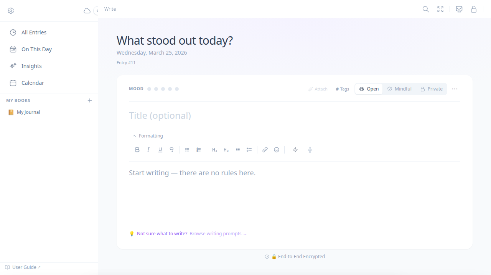
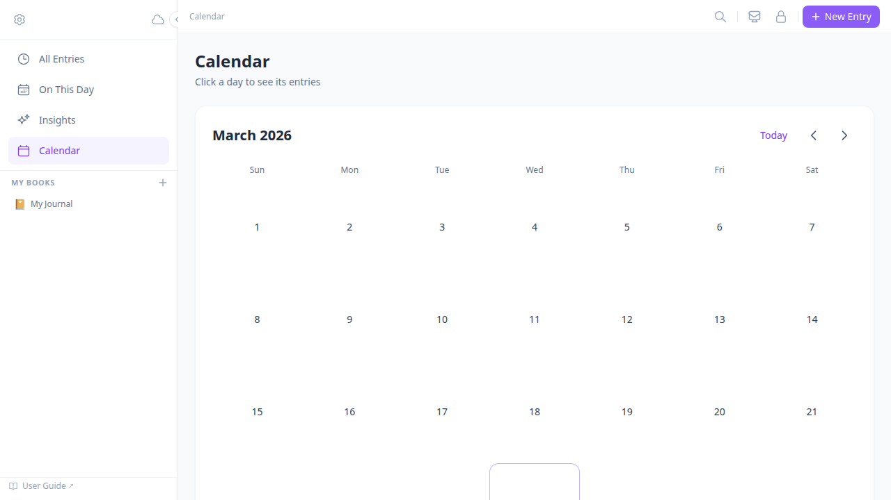
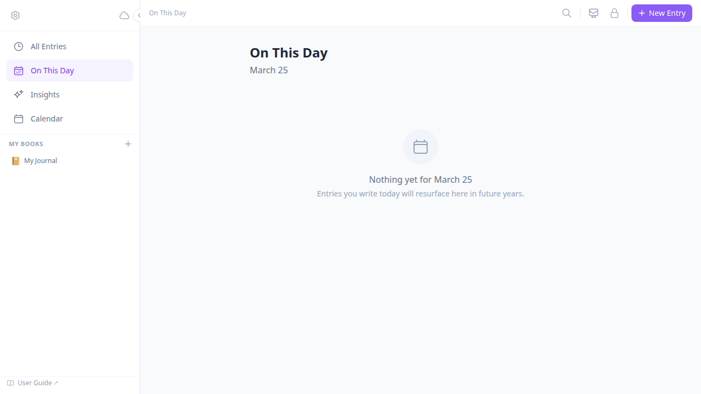
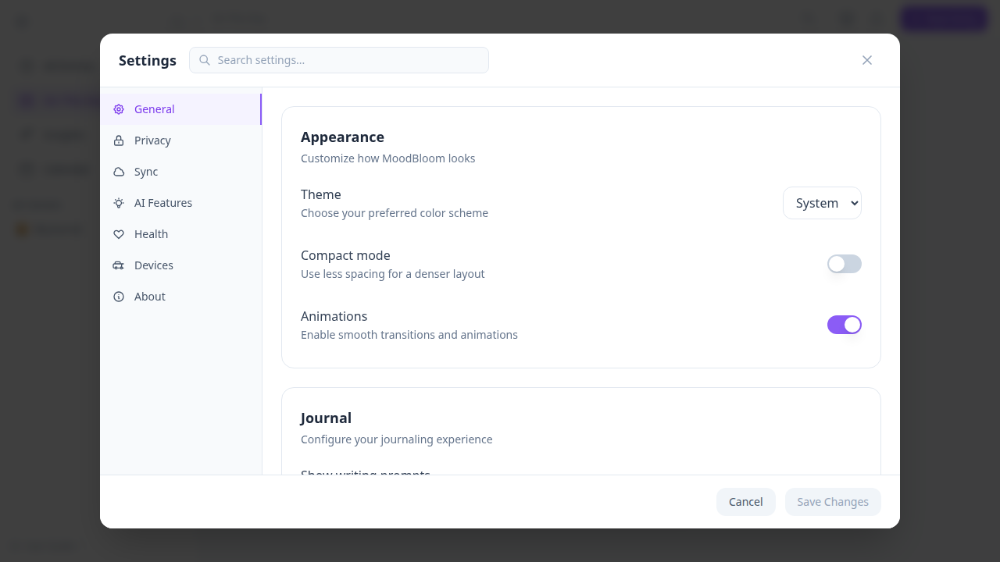

<div align="center">


<h1>MoodHaven Journal</h1>

<p><strong>Secure. Private. Cross-platform journaling — desktop, browser, Android &amp; Wear OS.</strong></p>

<p>
<a href="https://github.com/kenlacroix/moodhaven-journal/releases"></a>
<a href="LICENSE"></a>
<a href="https://github.com/kenlacroix/moodhaven-journal/stargazers"></a>
<a href="https://github.com/kenlacroix/moodhaven-journal/actions/workflows/test.yml"></a>
<a href="#installation"></a>
<a href="#watch--phone-companion-beta"></a>
<a href="https://tauri.app"></a>
<a href="#security--privacy"></a>
</p>

<p>MoodHaven Journal is a zero-knowledge journaling app designed to keep your thoughts safe.<br>Your entries are encrypted end-to-end, and your password never leaves your device.</p>

<p><a href="#installation">Download</a> · <a href="#building-from-source">Build from Source</a> · <a href="#security--privacy">Security Model</a> · <a href="https://github.com/kenlacroix/moodhaven-journal/wiki">Wiki</a> · <a href="#contributing">Contributing</a></p>

</div>

---

## 🌟 Why MoodHaven Journal?

| | |
|:---|:---|
| 🔒 **Privacy-first** | AES-256-GCM + PBKDF2 encryption — only you can read your entries. No accounts, no telemetry, no backdoors. |
| 🌐 **Truly cross-platform** | Native desktop (Windows, macOS, Linux), installable PWA, Android bridge, and Wear OS companion. |
| 🧠 **Smart journaling tools** | Mood tracking, time capsules, guided templates, and local analytics to reflect on your mental wellness. |
| 🔄 **Secure multi-device sync** | WebDAV, Dropbox, and Google Drive backup (all encrypted client-side) plus encrypted LAN peer sync — no centralised server required. |
| 📱 **Offline-ready** | Works fully offline. The web app is installable; the desktop app needs no internet at all. |

---

## Screenshots

| Writing View | Calendar |
|:---:|:---:|
|  |  |

| On This Day | Settings |
|:---:|:---:|
|  |  |

---

## 🚀 Get Started

**Desktop** — Download the latest release from [Releases](https://github.com/kenlacroix/moodhaven-journal/releases):

| Platform | Installer |
|:---|:---|
| Windows | `MoodHaven_1.6.0.1_x64-setup.exe` |
| macOS | `MoodHaven_1.6.0.1_x64.dmg` |
| Linux | `moodhaven_1.6.0.1_amd64.AppImage` or `.deb` |

**Browser** — Run directly in your browser or self-host with the `dist-web/` build. No Rust or install required.

```bash
VITE_DEV_MODE=bypass npm run dev:web    # local dev server (skips Tauri auth gate)
npm run build:web                        # production build → dist-web/
```

**Mobile** — Android bridge and Wear OS companion APKs are in [Releases](https://github.com/kenlacroix/moodhaven-journal/releases) as `moodhaven-phone-debug.apk` and `moodhaven-wear-debug.apk`. Requires Android 11+ and Wear OS 3.0+.

### First Launch

1. The setup wizard opens automatically.
2. Create a password. **Write it down — there is no server-side recovery.**
3. Optionally generate a 24-character offline recovery key.
4. Optionally enable TOTP 2FA or a hardware key (YubiKey/FIDO2).
5. Start writing.

---

## Features

| Write | Track |
|:---|:---|
| Rich text editor (bold, italic, headings, lists) | 5-level mood scale with auto-detection as you type |
| 7 guided templates (Gratitude, Goals, Free Write…) | Calendar heatmap and mood trend charts |
| Multiple journals (Books) with colour-coding | 53-week year heatmap, streak calendar, and day-of-week mood patterns |
| Privacy mode per entry (Open / Mindful / Private) | Insights view with AI prompts *(opt-in, metadata only)* |
| Focus mode — hides UI, enables typewriter scroll | On This Day — resurfaces past entries by date |
| Speech-to-text via offline whisper.cpp sidecar | Full-text search with mood and date filters (`Ctrl+K`) |
| Time capsules — seal an entry until a future date | Sentiment and emotional trends — all computed locally |
| Location & weather context at entry creation | Voice memo draft pipeline — review and edit before publishing |
| Writing appearance drawer — font, size, line height, tint | |

| Protect | Sync |
|:---|:---|
| AES-256-GCM encryption, PBKDF2 key derivation | LAN peer sync — no cloud server, no accounts |
| Zero-knowledge: app never sees your plaintext | Encrypted cloud backup: WebDAV, Dropbox, Google Drive |
| TOTP 2FA and native FIDO2 hardware key support | Encrypted `.moodhaven` export for offline archival |
| Optional 24-character offline recovery key | Encrypted peer sync across your own devices |

| Wear OS Companion *(beta)* | Android Phone Bridge *(beta)* |
|:---|:---|
| Record voice memos from your wrist (up to 10 min) | Receives audio over Wear OS ChannelAPI |
| Quick mood taps — 4 levels, one tap | Forwards memos to desktop for whisper.cpp transcription |
| Health snapshot at recording time (HR, activity) | Offline queue — memos held until desktop is reachable |
| Auto-arc recording indicator, breathe sessions | Works in background; no app open required |

---

## Installation

### Download a Release

Grab the latest build from the [Releases](https://github.com/kenlacroix/moodhaven-journal/releases) page:

| Platform | Installer | Minimum Version |
|:---|:---|:---|
| **Windows** | `MoodHaven_1.6.0.1_x64-setup.exe` | Windows 10 |
| **macOS** | `MoodHaven_1.6.0.1_x64.dmg` | macOS 10.15 Catalina |
| **Linux** | `moodhaven_1.6.0.1_amd64.AppImage` | Any modern distro |
| **Linux (Debian)** | `moodhaven_1.6.0.1_amd64.deb` | Ubuntu 22.04+ |
| **Web** | `npm run build:web` → serve `dist-web/` | Any modern browser |

### First Launch

1. The setup wizard opens automatically.
2. Create a password (8+ characters). **Write it down — there is no recovery without it unless you generate a recovery key.**
3. Optionally generate a recovery key — store it somewhere safe offline.
4. Optionally enable 2FA (TOTP app or hardware key).
5. Start writing.

---

## Getting Started

### Creating Entries

Open MoodHaven Journal and start typing — a new entry begins automatically. The mood indicator updates as you write after 5 words. To override, click any mood dot and it locks.

**Quick entry tips:**

- Use a **template** (Templates button, or `Ctrl+T`) for guided prompts — each prompt appears as a styled blockquote you can write under or delete.
- Toggle **focus mode** (the `⊙` button in the toolbar) to eliminate all distractions.
- Your entry auto-saves every few seconds. No save button needed.

### Organising with Books

Books are named journals — think Work, Personal, Travel, Therapy. Each has an emoji and colour.

- Create a book from the **My Books** section in the sidebar.
- The currently selected book is used for new entries.
- Filter the **All Entries** timeline to a single book by clicking it in the sidebar.

### Viewing Your History

| View | What it shows |
|:---|:---|
| **All Entries** | Chronological timeline with search, mood filter, and date range filter |
| **On This Day** | Entries from this exact date in previous years |
| **Insights** | AI-generated prompts and observations + full local analytics |
| **Calendar** | Monthly mood heatmap with 24-hour daily timeline |

---

## Keyboard Shortcuts

| Shortcut | Action |
|:---|:---|
| `Ctrl+K` / `⌘K` | Open search |
| `Ctrl+Enter` | Save and close entry |
| `Ctrl+T` | Open template picker |
| `Ctrl+F` | Toggle focus mode |
| `Ctrl+Shift+L` | Lock journal |

---

## Security & Privacy

All encryption happens client-side before any data touches the filesystem or network. The app has no master key and cannot decrypt your entries without your password.

```
Your Password
    │
    │  PBKDF2 (600,000 iterations + random salt per entry)
    ▼
Encryption Key (256-bit, never stored)
    │
    ├──▶  Journal entry content  ──▶  AES-256-GCM  ──▶  SQLite (ciphertext only)
    ├──▶  Export file payload   ──▶  AES-256-GCM  ──▶  .moodhaven file
    └──▶  Peer sync payload     ──▶  AES-256-GCM  ──▶  LAN transport
```

**Stored unencrypted (intentional):** mood level (analytics), timestamps (calendar), weather/location (opt-in), hashtags (search).

**Never stored:** your password, encryption keys, journal text in plaintext.

| Situation | Recovery |
|:---|:---|
| Forgot password, no recovery key | Unrecoverable — must factory reset. |
| Forgot password, have recovery key | Enter the 24-character code on the lock screen. |
| Lost hardware key, have password | Disable 2FA via password on the lock screen. |

**AI privacy:** when AI features are enabled, journal text is never sent to any external service — only anonymised metadata (mood scores, entry frequency, time-of-day patterns).

Full security model: [SECURITY.md](SECURITY.md)

MoodHaven Journal is an indie project built and maintained by one person. The cryptographic primitives (AES-256-GCM, PBKDF2, Ed25519) are standard and auditable; no independent third-party security audit has been conducted.

---

## Local Peer Sync

Sync directly between your devices on the same LAN — no cloud accounts, no third-party servers, no configuration.

```
┌─────────────────────────────────────────────────────────────┐
│  Layer 4: Encrypted Sync Engine                             │
│  TCP transport · AES-256-GCM payload · LWW conflict resolve │
├─────────────────────────────────────────────────────────────┤
│  Layer 3: Secure Pairing                                    │
│  QR code or 6-digit PIN → trusted_devices.json              │
├─────────────────────────────────────────────────────────────┤
│  Layer 2: Peer Discovery                                    │
│  mDNS/DNS-SD (_moodhaven._tcp.local) · zero config           │
├─────────────────────────────────────────────────────────────┤
│  Layer 1: Device Identity                                   │
│  Ed25519 key pair · stable deviceId per device              │
└─────────────────────────────────────────────────────────────┘
```

Pair once via QR code or PIN in **Settings → Devices**. After that, devices sync automatically whenever they're on the same network.

Full protocol details: [docs/peer-sync-security.md](docs/peer-sync-security.md)

---

## Watch & Phone Companion *(beta)*

Capture a voice reflection from your wrist before the thought fades. When you sit down at your desk, the transcription is waiting.

```
Wear OS Watch  →  Android Phone (bridge)  →  MoodHaven Desktop
  Tap to record     Receives via ChannelAPI    whisper.cpp transcribes
  Quick mood tap    Offline queue + retry      "Create Entry" pre-fills editor
  Health snapshot   Background, no app open    Mood tap stored as signal
```

**Audio never leaves your devices.** No upload step. Transcription runs locally via whisper.cpp.

Full architecture: [docs/watch-companion.md](docs/watch-companion.md)

---

## 🛠️ Tech Stack

| Layer | Technology |
|:---|:---|
| **Desktop shell** | [Tauri 2](https://tauri.app) (Rust) |
| **Frontend** | React 18 + TypeScript + TailwindCSS |
| **Rich text** | [TipTap](https://tiptap.dev) |
| **State** | [Zustand](https://zustand-demo.pmnd.rs) |
| **Database** | SQLite via [rusqlite](https://github.com/rusqlite/rusqlite) (bundled) / IndexedDB (browser) |
| **Encryption** | AES-256-GCM + PBKDF2 (WebCrypto API) |
| **Peer identity** | Ed25519 ([ed25519-dalek](https://github.com/dalek-cryptography/curve25519-dalek)) |
| **2FA** | [totp-rs](https://github.com/constantoine/totp-rs) + native CTAP2/HID |
| **Testing** | [Vitest](https://vitest.dev) + Testing Library · 1245 tests |
| **Build** | Vite 8 + Tauri CLI |
| **Mobile** | Kotlin + Wear OS Data Layer (MessageAPI + ChannelAPI) |

---

## Building from Source

### Prerequisites

- [Node.js](https://nodejs.org/) 18+
- [Rust](https://rustup.rs/) 1.77+

### Linux

```bash
sudo apt install -y libwebkit2gtk-4.1-dev libgtk-3-dev \
  libayatana-appindicator3-dev librsvg2-dev

git clone https://github.com/kenlacroix/moodhaven-journal.git
cd moodhaven-journal && npm install && npm run tauri build
```

### macOS

```bash
xcode-select --install
git clone https://github.com/kenlacroix/moodhaven-journal.git
cd moodhaven-journal && npm install && npm run tauri build
```

### Windows

Install [Visual Studio Build Tools 2022](https://visualstudio.microsoft.com/downloads/) with **Desktop development with C++**, then:

```powershell
git clone https://github.com/kenlacroix/moodhaven-journal.git
cd moodhaven-journal && npm install && npm run tauri build
```

### Development

```bash
npm run tauri dev    # hot-reload desktop dev
npm run dev:web      # browser dev server (no Rust needed)
```

### Web (Browser) Build

```bash
npm run build:web    # Outputs to dist-web/
npm run preview:web  # Serve dist-web/ locally to verify
```

No Rust or system dependencies required. The browser build swaps Tauri IPC for IndexedDB via Vite module aliasing.

### Build with Hardware Key Support

```bash
cd src-tauri
cargo build --release --features hardware-key
```

> **Note:** Requires `libudev-dev` on Linux at compile time and `libudev1` at runtime.

Full cross-platform build guide: [docs/build.md](docs/build.md)

---

## Testing & Feedback

MoodHaven Journal v1.0 is stable and used in daily production. If you encounter a bug or want to contribute a test report:

**Desktop:**
- **Try the full setup flow** — First-run wizard, password, 2FA, recovery key
- **Write entries and use Books** — Does auto-save, mood detection, and templates behave as expected?
- **Test on your OS** — Especially Windows and macOS (primary dev is on Linux)
- **Exercise peer sync** — If you have two machines on the same LAN, try pairing and syncing
- **StillHaven** — Enable in Settings → Health; run a session (try Forest/Sky environments), check journal handoff and Wrist Loop banner

**Wear OS companion *(needs Wear OS 3+ hardware)*:**
- **Record a voice memo** — tap to record, stop, confirm it arrives and transcribes on the desktop
- **Send mood taps** — do they land in the desktop app even if MoodHaven Journal isn't in the foreground?
- **Offline queue** — send taps while the phone is out of range, reconnect, confirm they drain

File issues at [GitHub Issues](https://github.com/kenlacroix/moodhaven-journal/issues). Screenshots are always appreciated.

---

## Contributing

Contributions are welcome. See [CONTRIBUTING.md](CONTRIBUTING.md) for guidelines.

Areas where help is especially appreciated:

- **Security audit** — `src/lib/services/crypto.ts` and `src-tauri/src/db/`
- **Accessibility** — WCAG 2.1 AA compliance
- **Internationalisation** — translation support
- **UI/UX** — designs, mockups, and screenshots

Please open an issue before opening a PR for significant changes. For security vulnerabilities, open a private advisory on GitHub.

```bash
git clone https://github.com/kenlacroix/moodhaven-journal.git
cd moodhaven-journal
npm install
npm run tauri dev
```

```bash
npm test                          # 1245 tests across 82 files
npm run typecheck                 # TypeScript strict check
cd src-tauri && cargo check       # Rust compilation check
```

See [CLAUDE.md](CLAUDE.md) for architecture, security guidelines, and conventions.

**Documentation:**

| Topic | Link |
|:---|:---|
| Architecture overview | [docs/architecture.md](docs/architecture.md) · [Wiki](https://github.com/kenlacroix/moodhaven-journal/wiki/Architecture-Overview) |
| Tauri command reference | [docs/tauri-commands.md](docs/tauri-commands.md) · [Wiki](https://github.com/kenlacroix/moodhaven-journal/wiki/Tauri-Command-Reference) |
| Security model | [SECURITY.md](SECURITY.md) · [Wiki](https://github.com/kenlacroix/moodhaven-journal/wiki/Security-Model) |
| Threat model | [docs/threat-model.md](docs/threat-model.md) |
| Peer sync protocol | [docs/peer-sync-security.md](docs/peer-sync-security.md) · [Wiki](https://github.com/kenlacroix/moodhaven-journal/wiki/Peer-Sync-Security) |
| Speech-to-text | [docs/speech-to-text.md](docs/speech-to-text.md) · [Wiki](https://github.com/kenlacroix/moodhaven-journal/wiki/Speech-to-Text) |
| Watch companion | [docs/watch-companion.md](docs/watch-companion.md) · [Wiki](https://github.com/kenlacroix/moodhaven-journal/wiki/Watch-Companion) |
| Build guide | [.claude/docs/build.md](.claude/docs/build.md) · [Wiki](https://github.com/kenlacroix/moodhaven-journal/wiki/Building-from-Source) |
| Changelog | [CHANGELOG.md](CHANGELOG.md) · [moodhaven.app/changelog](https://moodhaven.app/changelog) |

---

## Recent Changes

**v1.8.0** — **Security release.** Whole-database encryption at rest now actually engages — verified end-to-end on the installed build — after a key-format bug had left it inert since 1.7.0 (journal text was always encrypted; database metadata was readable at rest with file access). Found and fixed via the project's own pentest campaign, alongside PT6–PT10 hardening: full-DB restore consent gate, default-deny session lock, peer-sync reliability, recovery/restore data-loss fixes, key/password zeroization, OAuth-token-at-rest encryption. Upgrade recommended; see CHANGELOG. Also in 1.8.0: Mood analytics Phase 1 (53-week year heatmap, all-time trend, day-of-week chips, streak calendar; `get_year_heatmap`). 1,512 frontend + 195 Rust tests.
**v1.7.4** — Security hardening: PT5 fixes — `write_text_file` path blocklist extended to cover Windows attack paths, factory reset deletes WAL/SHM sidecar files, PBKDF2 key material wrapped in `Zeroizing` in `two_factor.rs`, `data_management.rs`, and `media.rs`.
**v1.6.0.1** — Forest and Sky rendering environments for StillHaven sessions. `EnvironmentPicker` lets users select the visual backdrop before starting a session. Patch fixes an environment-state regression from v1.6.0. 1283 tests.
**v1.5.0** — Wrist Loop: watch sends a `still_trigger` signal to request a StillHaven session; `WristLoopBanner` renders a dismissable toast on desktop; `still_signal_links` table records signal→session provenance. Time of Day Insight card and Writing Momentum card added to the Insights view (no AI required). `useWristLoop` hook. 1245 tests.
**v1.4.0** — StillHaven Effect: correlation card shows per-protocol activation delta vs. post-session journal mood; protocol recommendations surface in Session History. New `still_get_effect_stats` command. 1201 tests.
**v1.3.1.0** — ACL hardening: four StillHaven commands were silently unreachable at runtime; 2FA backend enforcement; backup code KDF upgrade. 1185 tests.
**v1.3.0** — Word count tracking: `word_count` column added to journal entries, displayed below tags in Timeline. Session linkage: entries can be linked to StillHaven sessions; WellbeingCard morning context card shows once per day. Three new StillHaven commands (`still_get_wellbeing_context`, `still_get_session_brief`, `still_get_journal_brief_for_session`). 1165 tests.
**v1.2.1** — Security hardening: TOTP secrets encrypted at rest (AES-256-GCM, amber migration banner for v1.1.x users), path traversal fix in media storage, writer window scoped to ~30 commands only, backend rate limiting on `verify_password` (5 failures → 30s lockout), settings sync allowlist, full-restore SHA-256 integrity check, CSP narrowed.
**v1.2.0** — Voice memo draft pipeline: watch recordings surface as reviewable draft cards in the Timeline with transcription preview, inferred mood, biometric context, and hashtag suggestions. Full TipTap editor to edit before publishing. Writing appearance drawer: inline font, size, line height, paragraph spacing, background tint, and accessibility options (high contrast, reduced motion, dyslexia profile) in WritingView. Wear OS Phase B brand sweep (60+ hex colors to @color/ references), Phase C splash screen, Phase 2e/5a polish (shortcut row, ambient mood wash, steps + activity in HealthSnapshot). Codebase cleanup: 5 large components split, dead code removed. 1143 tests.
**v1.1.0** — StillHaven: bilateral audio stimulation companion built into all builds. Enable in Settings → Health to unlock. Check-in (protocol + activation dial) → live session (bilateral audio engine, bio-adaptive speed via Oura/watch) → check-out → summary → journal handoff pre-fills the writing view with session data. Session history view with 30-day trend chart. Browser/web fully supported via IndexedDB shim. 736 tests.
**v1.0.0** — First stable release. Zero-knowledge AES-256-GCM encryption, local-first SQLite, LAN peer sync (Ed25519 + mDNS + PIN pairing), Wear OS voice memos, AI insights (BYOK/Ollama), time capsules, STT (whisper.cpp, 3-layer pipeline), virtual scroll timeline, full analytics suite. MIT licensed, no paid tier. 736 tests across 48 files.
**v0.9.4** — Website overhaul: replaced rain hero with on-brand violet gradient + app screenshot, removed all Pro/waitlist/pricing language, rewrote FAQ as FOSS-first, added GitHub star badge and trust strip, 7 new blog posts from Substack with unique hero images, per-post branded OG cards via `next/og`, newsletter signup, founder card on About, blog post download CTAs, full SEO pass (canonical URLs, JSON-LD, Open Graph), Android sideload guide on Download page.
**v0.9.3** — Polish, QoL, and /review fixes: live STT recording strip in the editor toolbar, full model download UI in SpeechToTextTab, TagCloud tag filtering in the timeline, virtual scroll for large vaults, per-device last-sync timestamps in Devices tab, Privacy Transparency document, `use2FASetup` hook extraction, `useAppBanners` streak/OTD hook, `get_entries_on_this_day` Rust SQL command. 7 bugs fixed from /review pass. 693 tests.
**v0.9.2** — STT recording UI, virtual scroll, TagCloud, devices last-sync, Privacy Transparency system, `useAppBanners` hook (streak milestones + On This Day), mood sparkline in sidebar, keyboard shortcuts (`1–5` mood, `?` cheatsheet). 676 tests.
**v0.9.1** — v0.9.0 regression fixes: unlock was blocked by missing ACL permissions (`verify_password` and 9 others absent from ACL allow-list), factory reset was blocked from the lock screen, wrong-password errors showed the generic message instead of attempt count. Settings service now silently swallows `Session is locked` errors on startup. 667 tests.
**v0.9.0** — Password verification moved to Rust (SEC-DEFER-001): PBKDF2 hash check now runs entirely in the backend — the hash never leaves Rust. Analytics, time capsule, Oura, and settings commands now require an unlocked session. SpeechToTextTab added as the 9th settings tab (model download UI coming v0.9.1). 654 tests.
**v0.8.5.1** — Android Wear companion patch: tile tap regression fix, `WearProtocol.PATH_FEEDBACK` constant, HR timeout log level promoted to `Log.i`.
**v0.8.5** — Peer sync engine refactored from a 2,554-line monolith into a proper Rust module directory (`protocol`, `crypto`, `connection`, `conflict`). Wire format and session protocol unchanged — no user-visible behaviour change.
**v0.8.4** — Security housekeeping: Vite 5→8 resolves esbuild CORS CVE (GHSA-67mh-4wv8-2f99), DOMPurify added as second XSS layer in update panel, all CI Actions pinned to immutable commit SHAs. 641 tests.
**v0.8.0** — Browser/PWA port: IndexedDB backend, ETag-guarded WebDAV sync, PWA manifest, `npm run dev:web` / `build:web`. Fixed `dbDeleteBook` race and monthly mood date range bug. 629 tests.
**v0.7.15** — Wear OS companion polish: AudioFrameParser refactor, offline queue O(1) eviction, exponential backoff retries, MoodComplicationService 30s cache, adversarial security fixes.
**v0.7.14** — SettingsPage split into 7 focused tab components; 6 Rust unit tests for time capsule seal/unseal logic.
**v0.7.13** — Selective export with tag/mood/date filters, `EntryStateBadge` with `thinking/complete/revisit` states. 585 tests.

Full history: [CHANGELOG.md](CHANGELOG.md)

---

## License

[MIT](LICENSE) — © MoodHaven Journal contributors

---

<div align="center">
<sub>Built with care for people who write to understand themselves.</sub>
</div>
