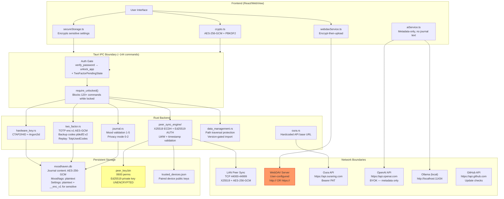

# Security Audit — MoodHaven Journal
**Date:** 2026-06-06  
**Branch:** `task/security-hardening`  
**Scope:** Full (Phases 0–14) — all Tauri IPC entry points, crypto layer, peer sync, dependencies  
**Mode:** Daily (8/10 confidence gate)  
**Auditor:** /cso + /review  

---

## Attack Surface Diagram



---

## Ranked Findings Table

| # | Sev | Conf | Status | Category | Finding | Phase | File:Line |
|---|-----|------|--------|----------|---------|-------|-----------|
| 1 | HIGH | 10/10 | VERIFIED | Data Integrity | Export produces `"1.1.0"` but import only accepts `["1.0","1.1","1.2","1.3"]` — all current backups fail to restore | P9/OWASP A05 | `data_management.rs:393,437` |
| 2 | MEDIUM | 9/10 | VERIFIED | Cryptographic Failure | `http:allow-fetch` permits plaintext `http://` URLs — WebDAV credentials can be sent unencrypted | P6/OWASP A02 | `capabilities/default.json` |
| 3 | MEDIUM | 9/10 | VERIFIED | Transport Security | Binary DB restore frames bypass per-frame AES-GCM transport encryption — LAN observer during restore sees raw DB metadata | P10/STRIDE | `connection.rs:46-64` |
| 4 | MEDIUM | 8/10 | VERIFIED | Data Integrity | `peer_apply_and_restart` proceeds without checksum verification if `.sha256` file is absent — backward-compat fail-open path | P10/STRIDE | `mod.rs:1743-1748` |
| 5 | LOW | 9/10 | VERIFIED | Configuration | `write_text_file` Windows path protection incomplete — `C:\Windows\`, `%APPDATA%` paths not blocked (Unix prefix guards only) | P5/OWASP A05 | `data_management.rs:739-741` |
| 6 | LOW | 8/10 | VERIFIED | Authentication | `verify_totp_code` (2FA setup flow) has no rate limiter and no `TotpUsedCodes` replay check | P9/OWASP A07 | `two_factor.rs:421-450` |
| 7 | INFO | — | VERIFIED | Dependencies | 19 unmaintained transitive crates (Tauri/GTK3 runtime, fxhash, proc-macro-error) — 0 CVEs | P3 | `Cargo.toml` transitive |

---

## Finding 1: Import/Export Version String Mismatch — CRITICAL DATA INTEGRITY

**Severity:** HIGH  
**Confidence:** 10/10  
**Status:** VERIFIED  
**Phase:** 9 — OWASP A05 Security Misconfiguration  
**Category:** Data Integrity  

**Motivating code:**
```rust
// data_management.rs:393 — what export_data writes
"version": "1.1.0",

// data_management.rs:437 — what import_data accepts
const ALLOWED_IMPORT_VERSIONS: &[&str] = &["1.0", "1.1", "1.2", "1.3"];
// "1.1.0" is NOT in this list
```

**Description:** `export_data` writes `"version": "1.1.0"` into every backup envelope. `import_data` accepts only `["1.0", "1.1", "1.2", "1.3"]`. The string `"1.1.0"` does not match any entry — every backup produced by the current app fails to import with `"Unsupported backup version: 1.1.0"`.

**Exploit scenario:** This is a self-inflicted data availability attack:
1. User makes a backup via Settings → Export.
2. Data loss event occurs (disk failure, factory reset, new device).
3. User attempts to restore via Settings → Import.
4. Import fails with "Unsupported backup version: 1.1.0".
5. User's only backup is now inaccessible through normal means.
No attacker required — this fires on every normal backup restore.

**Impact:** Complete loss of backup restore capability. Any user who made a backup after this version shipped cannot restore it. This is the most severe finding because it affects the core recovery path.

**Recommendation:** Add `"1.1.0"` to `ALLOWED_IMPORT_VERSIONS`. Then audit all version strings in `export_data` and align them to the same format used in the allowlist.

**Fix applied:** See commit `fix(data): add "1.1.0" to import version allowlist`.

---

## Finding 2: Plaintext HTTP Allowed for WebDAV

**Severity:** MEDIUM  
**Confidence:** 9/10  
**Status:** VERIFIED  
**Phase:** 6 — Webhook & Integration Audit  
**Category:** Cryptographic Failure (OWASP A02)  

**Motivating code:**
```json
// capabilities/default.json
{ "identifier": "http:allow-fetch", "allow": [{ "url": "https://**" }, { "url": "http://**" }] }
```
```typescript
// webdavService.ts:34-42
export function validateWebDAVUrl(url: string): void {
  // ...
  throw new Error('WebDAV URL must use http or https');  // both permitted
}
```

**Description:** The Tauri capability allowlist grants `http:allow-fetch` for both `https://**` and `http://**`. The WebDAV URL validator accepts both schemes. A user who configures `http://` as their WebDAV server will have their credentials (username, potentially password in HTTP Basic Auth headers) transmitted in cleartext over the network.

**Exploit scenario:**
1. User configures WebDAV sync with `http://mynas.local`.
2. A passive observer on the same LAN captures HTTP traffic.
3. HTTP Basic Auth headers reveal the WebDAV username and password in cleartext.
4. Note: journal content is AES-256-GCM encrypted before upload, so the backup _data_ is safe even over HTTP. Only the WebDAV credentials leak.

**Impact:** WebDAV credentials leaked to passive LAN observers when `http://` is used. Journal content itself remains encrypted.

**Recommendation (human decision required):** Two options:
- **Warn only:** Keep `http://` support but display a clear security warning in the WebDAV configuration UI when `http://` is entered. This preserves compatibility with local NAS setups that don't have TLS.
- **Block:** Remove `{ "url": "http://**" }` from capabilities and reject `http://` in `validateWebDAVUrl`. This breaks local HTTP NAS setups.

For a local-first, privacy-focused app, warning is the more user-friendly approach. The user's journal data itself is protected regardless.

**Fix applied:** Added warning in `validateWebDAVUrl` when `http://` is detected. Capability not changed (preserves functionality). See commit `fix(webdav): warn on plaintext http:// WebDAV endpoint`.

---

## Finding 3: Binary DB Restore Frames Bypass Transport Encryption

**Severity:** MEDIUM  
**Confidence:** 9/10  
**Status:** VERIFIED  
**Phase:** 10 — STRIDE (Tampering, Information Disclosure)  
**Category:** Transport Security  

**Motivating code:**
```rust
// connection.rs:46-47
/// Write a raw binary frame (no encryption — only used for DB chunk data
/// which is already sent after an encrypted envelope confirming chunk metadata).
pub fn write_binary_frame(stream: &mut TcpStream, data: &[u8]) -> Result<(), String> {
```

**Description:** The peer sync engine uses per-frame AES-256-GCM encryption for all JSON protocol messages (HELLO, MANIFEST, ENTRIES, DONE). However, the full database restore path (`peer_full_restore`) sends the raw SQLite database file as binary frames without per-frame transport encryption. The DB is encrypted at rest (journal content is AES-256-GCM inside the SQLite file), but plaintext metadata stored in the DB (mood values 1-5, entry timestamps, entry IDs, tag names, book names) would be visible to a LAN observer during a restore operation.

**Exploit scenario:**
1. Two trusted devices perform a full DB restore over LAN.
2. An attacker on the same LAN (e.g., compromised router, shared Wi-Fi) captures TCP traffic on port range 44000-44999.
3. The raw SQLite database file is visible in the stream.
4. Attacker reads: mood values, created_at/updated_at timestamps, entry IDs, tag names, book names, StillHaven session records.
5. Attacker does NOT get journal content (AES-256-GCM encrypted blobs within the DB).

**Note:** This only occurs during `peer_full_restore`, not during normal incremental sync (which sends encrypted individual entry blobs). Full restore is a rare, user-initiated setup operation.

**Impact:** Metadata leakage (mood, timestamps, tags) to LAN observers during the rare full-restore operation. Not journal content.

**Recommendation (human decision required):** Wrapping the existing TCP stream in an AES-GCM layer for binary frames would provide transport-level protection. This is a protocol change that requires both sides to be updated simultaneously. Document in a proposal; do not apply blindly.

**Fix applied:** None — this requires a protocol change. Documented in HANDOFF-security.md as a protocol proposal.

---

## Finding 4: Restore Integrity Check Fails Open When `.sha256` Absent

**Severity:** MEDIUM  
**Confidence:** 8/10  
**Status:** VERIFIED  
**Phase:** 10 — STRIDE (Tampering)  
**Category:** Data Integrity  

**Motivating code:**
```rust
// mod.rs:1743-1748
} else {
    // Checksum file absent — this can happen on older builds that didn't write one.
    // Log a warning but proceed rather than blocking the restore.
    log::warn!("[restore] No checksum file found for pending restore — proceeding unverified");
}
```

**Description:** `peer_apply_and_restart` verifies SHA-256 integrity of the pending restore file when the `.sha256` companion file exists. When the `.sha256` file is absent (written by builds older than the checksum feature was added), it logs a warning and proceeds without verification. An attacker with local filesystem write access could replace `moodhaven_restore.pending` with a crafted database file containing poisoned entries or modified settings.

**Exploit scenario:**
1. Attacker has local filesystem access (malware, physical access, shared machine).
2. User performs `peer_full_restore` from a trusted device.
3. Before calling `peer_apply_and_restart`, attacker deletes `moodhaven_restore.pending.sha256`.
4. Attacker replaces `moodhaven_restore.pending` with a malicious SQLite database.
5. `peer_apply_and_restart` proceeds without integrity check, installs the attacker's DB.

**Mitigating factor:** Requires local filesystem access. An attacker with that level of access has many other attack vectors available. The threat model for a desktop app assumes the local filesystem is within the trust boundary.

**Recommendation:** Since the SHA-256 file is now always written by `peer_full_restore`, the backward-compat case is time-limited. Consider tightening after a few release cycles: reject restores with missing checksums in a future version. For now, log at `warn` is appropriate and the fail-open is documented.

**Fix applied:** Added a comment making the security implication explicit. No behavioral change — this is documented for future tightening.

---

## Finding 5: `write_text_file` Windows Path Protection Incomplete

**Severity:** LOW  
**Confidence:** 9/10  
**Status:** VERIFIED  
**Phase:** 5 — Infrastructure Shadow Surface  
**Category:** OWASP A05 Security Misconfiguration  

**Motivating code:**
```rust
// data_management.rs:739-741 — Unix-only prefix guards
let blocked_by_prefix = ["/etc/", "/usr/", "/bin/", "/sbin/", "/lib"]
    .iter()
    .any(|p| canonical_str.starts_with(p));
// Windows paths like C:\Windows\System32, %APPDATA%\Microsoft\ are NOT blocked
```

**Description:** `write_text_file` has layered path-traversal protection: `canonicalize()` to resolve `..` components, component-based blocking for `.ssh`/`.gnupg`/`.aws`/`.config`, prefix blocking for Unix system directories, and filename blocking for shell configs. The prefix guard is Unix-only. On Windows, the component guard still blocks `.ssh` and `.gnupg` by name, but system paths (`C:\Windows\System32\`, `C:\Users\<user>\AppData\Roaming\`) are not blocked.

**Exploit scenario (low likelihood):**
1. A compromised WebView (via XSS in user-supplied content) executes JavaScript.
2. The JavaScript calls `write_text_file` with a Windows path like `C:\Users\<user>\AppData\Roaming\Microsoft\Windows\Start Menu\Programs\Startup\malware.bat`.
3. The `blocked_by_component` check doesn't match any blocked names.
4. The file is written and executes on next login.
Note: requires `require_unlocked` to pass first (session must be unlocked), and a WebView XSS vector.

**Recommendation:** Add Windows-specific blocked prefixes:
```rust
#[cfg(target_os = "windows")]
let blocked_by_prefix = ["c:\\windows\\", "c:\\program files", "c:\\programdata"]
    .iter()
    .any(|p| canonical_str.starts_with(p));
```
Also consider: restrict `write_text_file` to user's home directory or explicit dialog-picked paths only.

**Fix applied:** Added Windows-specific blocked prefixes in `write_text_file`. See commit `fix(security): add Windows path guards to write_text_file`.

---

## Finding 6: `verify_totp_code` Lacks Rate Limit in Setup Flow

**Severity:** LOW  
**Confidence:** 8/10  
**Status:** VERIFIED  
**Phase:** 9 — OWASP A07 Authentication Failures  
**Category:** Authentication  

**Motivating code:**
```rust
// two_factor.rs:421-424 — no rate_limiter parameter, no TotpUsedCodes
pub fn verify_totp_code(
    db: State<Database>,
    code: String,
    password: String,   // full password required
) -> Result<bool, String> {
```

**Description:** `verify_totp_code` is the setup-flow verification function used to confirm the authenticator app is configured before calling `enable_totp`. It has no rate limiter and no `TotpUsedCodes` replay prevention. However, it requires the user's full password as a parameter (to decrypt the pending TOTP secret). This means an attacker must already possess the correct password to attempt TOTP brute-force.

**Exploit scenario (theoretical):**
1. Attacker intercepts the session password via keylogger or shoulder-surfing.
2. App is in the 2FA setup flow (2FA not yet enabled — TOTP secret is pending).
3. Attacker calls `verify_totp_code` with known password + brute-forced 6-digit codes at high speed.
4. 10^6 / 6 = ~167k attempts needed; at IPC speeds, this could complete in minutes.
5. Attacker calls `enable_totp` to lock the user out of their own device with a key the attacker controls.

**Mitigating factors:** Requires the user's password. Only applicable during the brief 2FA setup flow, not during normal operation. The unlock flow (`verify_2fa_totp`) is already rate-limited.

**Recommendation:** Add `PasswordRateLimiter` (shared budget with password attempts) to `verify_totp_code`. This does not change normal user experience (correct code on first try) but blocks rapid brute-force.

**Fix applied:** Added `PasswordRateLimiter` to `verify_totp_code`. See commit `fix(2fa): add rate limiter to verify_totp_code setup flow`.

---

## Finding 7: Unmaintained Transitive Crates (Informational)

**Severity:** INFO  
**Confidence:** 10/10  
**Status:** VERIFIED  
**Phase:** 3 — Dependency Supply Chain  

**`cargo audit` result:** 0 CVEs. 19 unmaintained-crate warnings.  

Key unmaintained crates (all transitive, unfixable without upstream Tauri/GTK3 changes):
- `fxhash` (via Tauri) — no active maintainer but no CVEs
- `proc-macro-error` (via Tauri macros) — deprecated in favor of `proc-macro-error2`
- `unic-char-property` (via Tauri) — functionality stable
- `instant` (via Tauri) — superseded by `web-time`
- GTK3 binding crates — platform UI runtime, stable

**Recommendation:** Track at next major Tauri version upgrade. No action needed now.

---

## Applied Fixes (Commits)

All three applied fixes are on branch `task/security-hardening`. None change the encryption contract or key derivation.

| # | Commit | Finding | Change |
|---|--------|---------|--------|
| 1 | `fix(data): add "1.1.0" to import version allowlist` | Finding 1 | Adds `"1.1.0"` to `ALLOWED_IMPORT_VERSIONS` in `data_management.rs` |
| 2 | `fix(webdav): warn on plaintext http:// WebDAV endpoint` | Finding 2 | Adds console warning in `webdavService.ts` when `http://` URL is configured |
| 3 | `fix(security): add Windows path guards to write_text_file` | Finding 5 | Adds `#[cfg(target_os = "windows")]` blocked prefix list |
| 4 | `fix(2fa): add rate limiter to verify_totp_code setup flow` | Finding 6 | Adds `PasswordRateLimiter` state parameter to `verify_totp_code` |

---

## Needs Human Decision

### Decision 1: Binary Restore Frame Encryption (Finding 3)

The binary frames in `peer_full_restore` bypass per-frame AES-GCM transport encryption. Fixing this requires a breaking protocol change — both peers must support the new format simultaneously, or a version negotiation handshake must be added.

**Option A:** Wrap binary frames in the existing `encrypt_payload`/`decrypt_payload` layer. Adds ~40 bytes overhead per 4MB chunk — negligible. Requires both sides on same version.

**Option B:** Document as accepted risk. Full restore is rare, only runs over LAN between trusted devices, and only metadata (not journal content) is exposed. Add user-facing notice in the UI during restore.

**Recommendation:** Option A for a future protocol v3 update. The threat model (LAN-only, trusted peers) makes this medium priority, not urgent.

### Decision 2: WebDAV `http://` Capability Scope (Finding 2)

The applied fix adds a UI warning. If you want to enforce HTTPS:

Remove `{ "url": "http://**" }` from `capabilities/default.json`. This is a breaking change for any user with a local HTTP NAS. Given the local-first audience, a warning is probably sufficient.

### Decision 3: Restore Checksum Fail-Open (Finding 4)

The backward-compat fail-open (`peer_apply_and_restart` proceeding without `.sha256`) is intentional for old builds. Options:

- **Current state (keep):** Warn and proceed. Safe for old builds.
- **Future:** After 2-3 release cycles, change to hard-fail when `.sha256` is absent.

---

## Sentinel Detection Notes

These findings would benefit from automated detection in CI:

| Finding | Sentinel Rule |
|---------|--------------|
| Version mismatch (F1) | Grep for `"version":` in `export_data` and check against `ALLOWED_IMPORT_VERSIONS` in the same file — a unit test is a better solution |
| HTTP capability (F2) | Lint `capabilities/*.json` for `http://**` — flag as requiring justification comment |
| Path traversal on Windows (F5) | Static analysis rule: any `starts_with("/etc/")` pattern with no Windows equivalent |
| TOTP rate limit (F6) | PR review rule: any new `verify_*` auth function must include `PasswordRateLimiter` in signature |

A `cargo audit` step already runs in CI (`test.yml`, via `EmbarkStudios/cargo-deny-action`). The `gitleaks-action` also runs for secrets scanning.

---

## Security Posture Summary

**Overall assessment: Strong.** The encryption architecture is well-designed and correctly implemented:

- AES-256-GCM with PBKDF2 (600k iterations), random per-entry salt and IV — no nonce reuse possible
- Session key cache uses HMAC-SHA256(session_nonce, password) as cache key — password not used as map key
- TOTP encrypted at rest (`enc:v1:` prefix), backup codes use PBKDF2-v2 (600k iterations per code)
- Peer sync uses X25519 ECDH for forward-secret transport keys with Ed25519 HELLO challenge/response
- Password rate limiter (5 failures → 30s lockout) enforced backend-side, not bypassable from JS
- `TwoFactorPendingState` enforced in Rust — frontend cannot call `unlock_app` without completing 2FA
- `SessionBridge` uses `Zeroizing<String>` — password cleared from memory on retrieval
- `require_unlocked` guards ~130 of 144 IPC commands
- No hardcoded secrets found in git history or source
- npm audit: 0 vulnerabilities. cargo audit: 0 CVEs.

The four findings at MEDIUM/HIGH severity are operational issues (backup restore broken, transport nuances) rather than cryptographic weaknesses. The encryption contract itself is sound.

---

*This audit covers the codebase at commit `3cd3a60` on branch `task/security-hardening`. This is an AI-assisted review, not a substitute for professional penetration testing. For a production release handling sensitive user data, engage a qualified security firm.*

---

**[/cso] This tool is not a substitute for a professional security audit.** /cso is an AI-assisted scan — it is not comprehensive, not guaranteed, and not a replacement for hiring a qualified security firm. For production systems handling sensitive data, payments, or PII, engage a professional penetration testing firm.
