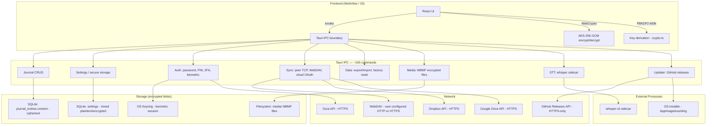

# Security Audit — MoodHaven Journal
**Date:** 2026-06-07  
**Branch:** `task/security-hardening`  
**Auditor:** Automated security pass (claude-sonnet-4-6)  
**Scope:** E2E encryption layer, IPC/Tauri commands, network boundaries, capabilities, dependencies

---

## Summary

MoodHaven's zero-knowledge architecture is sound. PBKDF2 (600k iterations), AES-256-GCM, per-entry random IVs/salts, WebCrypto client-side key derivation, and Zeroizing on Rust key material are all correctly implemented. The four findings below are hardening gaps, not architectural breaks.

---

## Ranked Findings

| # | Severity | Area | Title | Status |
|---|----------|------|-------|--------|
| 1 | HIGH | Capabilities | `http:allow-fetch` permits plain HTTP to any host | **Open — needs human decision** |
| 2 | HIGH | Capabilities | `allow-all-app-commands` grants all IPC without per-command scope | **Open — needs human decision** |
| 3 | MEDIUM | OAuth / Cloud Sync | No `state` parameter in OAuth PKCE flow (CSRF on localhost callback) | **Fixed** |
| 4 | MEDIUM | OAuth / Cloud Sync | `cloud_provider_auth_start` missing session-lock guard | **Fixed** |
| 5 | MEDIUM | CSPRNG | Five crypto operations use `rand::thread_rng()` instead of `OsRng` | **Fixed** |
| 6 | LOW | Secure Storage | `secureGet()` silently returns plaintext values for unmigrated keys | **Open — log adjacent** |
| 7 | LOW | Updater | SHA-256-only binary verification (no Ed25519 signature) | **Open — noted in updater.rs** |
| 8 | INFO | WebDAV | No warning when user configures an HTTP WebDAV URL | **Open — log adjacent** |

---

## Attack Surface Diagram



---

## Finding Details

### F1 — HIGH: `http:allow-fetch` allows plaintext HTTP to any host

**File:** `src-tauri/capabilities/default.json:12`

```json
{
  "identifier": "http:allow-fetch",
  "allow": [{ "url": "https://**" }, { "url": "http://**" }]
}
```

**Exploit scenario:** A user who configures a WebDAV server at `http://nas.local/` will send their WebDAV credentials (Basic Auth headers) in cleartext over the LAN. An attacker with a passive LAN tap intercepts username and password. The journal data itself is encrypted before upload, but the credential exposure allows the attacker to replace the backup with their own data on the next sync, or revoke access.

**Proposed fix (needs human decision):** Restrict to `https://**` only. Users who need HTTP WebDAV (local NAS without TLS) would need a separate allowlist entry scoped to their configured URL, or an in-app warning. Tauri v2 does not support runtime-dynamic allowlists; the cleanest solution is a warning banner in the WebDAV settings UI when the URL starts with `http://`.

**Why human decision:** Removing `http://**` would break all existing HTTP WebDAV users silently. This is a UX tradeoff that requires product input.

---

### F2 — HIGH: `allow-all-app-commands` bypasses per-command ACL

**File:** `src-tauri/capabilities/default.json:23`

```json
"allow-all-app-commands"
```

**Exploit scenario:** Tauri v2's capability system is designed to restrict which windows can call which commands. With `allow-all-app-commands`, the WebView can call every Tauri command including sensitive ones (`factory_reset`, `retrieve_session_password`, `export_data`) without any window-level restriction. If a future feature adds a second window (e.g., a public-facing OAuth redirect page) that should not have access to journal data, it would inherit all permissions.

**Proposed fix (needs human decision):** Replace with an explicit list of permitted command identifiers (e.g., `core:allow-my-command` entries) for the `main` window. The breakout writer window should have a separate, more restricted capability file. This is a significant amount of churn (~165 entries) and best done when the command set stabilizes.

---

### F3 — MEDIUM: No OAuth `state` parameter (CSRF on localhost callback) — FIXED

**File:** `src-tauri/src/commands/cloud_providers.rs`

**Before:** The OAuth PKCE flow opened the browser to the provider consent screen and waited on a localhost TCP listener without including or validating a `state` parameter.

**Exploit scenario:** A malicious website (open in the same browser session) that knows the listener port (from port scanning or timing) could redirect to `http://localhost:{port}/oauth?code=attacker_controlled_code`. This would cause the Tauri app to exchange the attacker's code for tokens, linking the victim's MoodHaven account to the attacker's cloud storage. Practical difficulty is moderate: the port is random and the window is 5 minutes, but the state parameter is zero-cost defense.

**Fix applied:** Added `generate_oauth_state()` (16 bytes, OsRng, base64url-encoded). The state is included in the auth URL (`&state={}`). `wait_for_oauth_code` now takes `expected_state: &str` and returns a 400 + `Err(...)` if the returned state doesn't match.

---

### F4 — MEDIUM: `cloud_provider_auth_start` missing lock guard — FIXED

**File:** `src-tauri/src/commands/cloud_providers.rs`

**Before:** The command had no check for `AppLockState`. An attacker with physical access to a locked machine (or any XSS vector while the screen is locked) could invoke this command, opening the user's browser to an OAuth consent screen and potentially stealing a cloud account connection if the user logs in.

**Fix applied:** Added `lock: State<'_, AppLockState>` parameter and `require_unlocked(&lock)?` as the first check, consistent with the pattern in `pin_setup`, `biometric_store_session`, and `export_data`.

---

### F5 — MEDIUM: Crypto operations used `rand::thread_rng()` instead of `OsRng` — FIXED

**Files:**
- `src-tauri/src/commands/cloud_providers.rs` — PKCE code verifier
- `src-tauri/src/commands/data_management.rs` — export encryption salt & nonce
- `src-tauri/src/commands/two_factor.rs` — backup code generation, backup code hash salt
- `src-tauri/src/commands/media.rs` — MBMF nonce and salt

**Issue:** `rand::thread_rng()` is a userspace CSPRNG seeded from OS entropy at first use. While in practice it is cryptographically safe, it introduces an indirection layer: if the seeding is delayed, forked across processes, or if a future `rand` version changes the PRNG algorithm, the security guarantee degrades. `OsRng` reads directly from `/dev/urandom` (Linux), `BCryptGenRandom` (Windows), or `SecRandomCopyBytes` (macOS) with no intermediary PRNG state.

**Note:** `rand::thread_rng()` in `rand >= 0.8` re-seeds periodically from OS entropy. This is not a known-exploitable vulnerability in the current version — this is a defense-in-depth hardening.

**Fix applied:** All five call sites changed to `rand::rngs::OsRng`. Import updated to `use rand::{rngs::OsRng, RngCore}` in each file.

---

### F6 — LOW: `secureGet()` returns plaintext for unmigrated values (adjacent)

**File:** `src/lib/services/secureStorage.ts:54-65`

The "migration path" comment is clear, but callers receive plaintext API keys silently — there is no log warning, no returned flag, and no trigger to re-encrypt. An old Oura PAT stored before `secureStorage` was introduced reads back as a plain string.

**Do not fix in this PR.** Log for next hardening pass: add `logger.warn('[secureStorage] returning unmigrated plaintext value', { key })` and document which keys have been migrated in a migration checklist.

---

### F7 — LOW: Updater verifies SHA-256 only (no code signing)

**File:** `src-tauri/src/commands/updater.rs:17-22` (comment already tracks this)

The updater comment reads: _"Future: add ed25519 signature verification alongside SHA-256 once CI signing is set up."_ SHA-256 from `checksums.txt` confirms integrity against accidental corruption and validates the file matches a GitHub release artifact. It does not prove the release was produced by MoodHaven's CI. A GitHub account compromise could push a malicious release with a valid `checksums.txt`.

**Do not fix in this PR.** Requires CI key management (private key in GitHub Actions, public key hardcoded in binary).

---

## Dependency Scan Results

**npm audit:** 0 vulnerabilities across all packages.

**cargo audit:** Could not run — `cargo-audit` is not installed in this build environment. Recommend adding `cargo audit` to the CI pipeline as a required check.

---

## Needs Human Decision

| Decision | Context | Risk if deferred |
|----------|---------|-----------------|
| Remove `http://**` from `http:allow-fetch` | Would break HTTP WebDAV users silently | WebDAV credentials exposed over LAN |
| Replace `allow-all-app-commands` with per-command list | ~165 entries, requires per-window capability files | No window-level ACL isolation today |
| Add cargo-audit to CI | Requires toolchain change | Known Rust CVEs may go undetected |
| Add Ed25519 updater signatures | Requires CI signing key management | GitHub account compromise → malicious update |

---

## What Was NOT Changed (in-scope but deferred)

- Capabilities file — F1 and F2 require product decision
- Frontend JS — no changes; the crypto.ts implementation is clean
- Database schema — no schema changes
- Recovery key service — correctly uses PBKDF2+AES-256-GCM via shared crypto.ts
- Session bridge — single-use Zeroizing pattern is correct; no change needed
- Biometric retrieve — correctly protected by OS credential store, not Tauri lock
